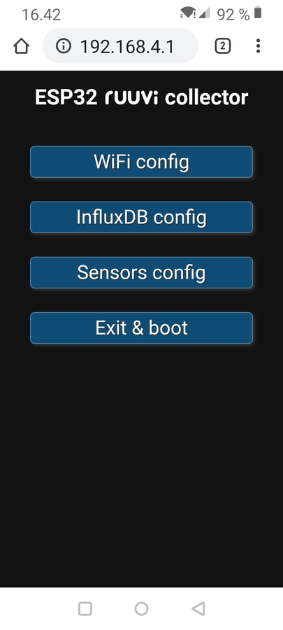
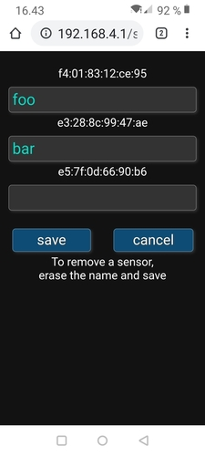

# ESP32 Ruuvi Collector
Web-configurable Ruuvi Collector that sends data to an InfluxDB. The InfluxDB data model is compatible 
with famous [Ruuvi Collector](https://github.com/Scrin/RuuviCollector) for Raspberry Pi

This is mostly derived from my [esp8266 onewire to InfluxDB client](https://github.com/oh2mp/esp_1wire_influxdb)

There is support only for protocols V3 (RAWv1) and V5 (RAWv2). It's also very recommended that you have
the latest stable [Ruuvi firmware](https://lab.ruuvi.com/dfu/). This software is developed and tested with 
version 2.5.9.

## Hardware prerequisities
- An ESP32 board
- One or more [Ruuvi tags](https://ruuvi.com/)

## Software prerequisities
- [InfluxDB](https://www.influxdata.com/) running somewhere in the internet
(or another software that can handle similar POST request).
- [Arduino IDE](https://www.arduino.cc/en/main/software)
- [Arduino ESP32 filesystem uploader](https://github.com/me-no-dev/arduino-esp32fs-plugin/)

First change partitioning setting from your Arduino IDE. **Tools -> Partition Scheme -> Huge APP(3MB No OTA)**

Enable PSRAM: **Tools -> PSRAM -> Enabled**

Use the filesystem uploader tool to upload the contents of data library. It contains the html pages for
the configuring portal.

By default the software assumes that there are maximum 8 Ruuvi tags, but this can be changed from the code,
see row `#define MAX_TAGS 8`

## Configuration option

The portal saves all configurations onto the SPIFFS filesystem. They are just text files, so you can
precreate them and then your ESP32 Ruuvi Collector is preconfigured and you dont' have to use the portal
at all. Just place yout configuration files into the data directory along the html files and 
upload them with ESP filesystem uploader.

See [FORMATS.md](FORMATS.md).

## Portal mode

You can connect a switch between GPIO32 and GND. If the pin is grounded, the ESP32 starts portal mode.
The pin can be also changed from the code, see row `#define APREQUEST 32`

In the start of portal mode the ESP32 is listening 10 seconds for new tags. During that period
the onboard LED is lit and WiFi AP is not listening yet.

When your board is in portal mode, it blinks the onboard LED at CPIO2. Take your phone and connect to 
WiFi network **ESP32 Ruuvi Collector** and accept that there's no internet connection etc.

Open your browser and go to `http://192.168.4.1/`

The web GUI should be self explanatory.

There's almost no sanity checks for the data sent from the forms. This is not a public web service and if you
want to mess up your board or make a denial of service to it using eg. buffer overflows, feel free to do so.

### Sample screenshots from the portal

